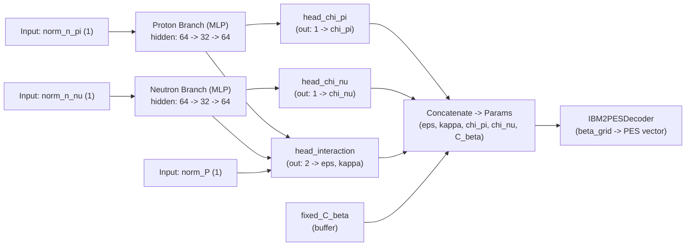

# MC_research_2 (project2)

## 概要
このプロジェクトは、ニューラルネットワークを用いて原子核物理学における **IBM2 (Interacting boson model 2)** のハミルトニアンのパラメータ ($\epsilon, \kappa, \chi_\nu, \chi_pi$) と PES (Potential energy surface) のスケール因子 ($C_\beta$)を推定するための研究用コードです。
**Hartree-Fock-Bogoliubov(HFB)** 法などで計算されたPESから、最適なIBM2パラメータを逆推定することを目的としています。また、推定されたパラメータを用いてIBMの計算コードである`NPBOS`を実行し、エネルギースペクトルを計算することで実験値と比較評価する機能も備えています。

## ディレクトリ構造

```
project2/
├── configs/            # 各種設定
├── data/               # データセット
│     ├ raw/
│     └ processed/
├── outputs/            # 学習結果, 評価結果など
├── src/                # ソースコード
│     ├ dataset.py
│     ├ losses.py
│     ├ model.py
│     ├ utils.py
│     └ visualize.py
├── scripts/
│     ├ analyze.py
│     ├ train.py
│     └ plot.py
├── requirements.txt    # Python依存ライブラリ
```

## 必要要件

*   **OS**: Linux (推奨)
*   **Python**: 3.8 以上
*   **Fortranコンパイラ**: `gfortran` (NPBOSのコンパイルに必要)

### Python ライブラリ
*   numpy
*   scipy
*   pandas
*   matplotlib
*   torch (PyTorch)
*   pyyaml

## セットアップ

### 1. Python環境の構築

**注意**: 以下のコマンドはすべて、プロジェクトのルートディレクトリ (`project1/`) で実行してください。

仮想環境を作成し、依存ライブラリをインストールすることをお勧めします。

```bash
# 仮想環境の作成と有効化 (例)
python -m venv venv
source venv/bin/activate

# ライブラリのインストール
pip install -r requirements.txt
```

### 2. NPBOS (Fortranコード) のコンパイル

評価パートでスペクトル計算を行うために、`NPBOS` ディレクトリ内のFortranプログラムをコンパイルし、必要なデータファイルを生成する必要があります。

```bash
cd NPBOS
chmod +x compile.sh
./compile.sh
cd ..
```
※ `compile.sh` は `gfortran` を使用して複数のソースコードをコンパイルし、初期化プログラムを実行します。

### 設定 (Configuration)

本リポジトリは `configs/` に設定ファイルを分割しています。主な設定と役割は次の通りです。

- `configs/base.yml`:
	- `data_dir`: データルート（例: `./data`）
	- `raw_dir`: 生データ配置（`data/raw`）
	- `processed_dir`: 前処理済みデータ保存先（`data/processed`）
	- `output_dir`: 学習や評価の出力先（`./outputs`）
	- `npbos_dir`: NPBOS 実行バイナリへのパス

- `configs/nuclei.yml`:
	- `z_min`/`z_max`/`z_step`: 陽子数 Z の範囲
	- `n_min`/`n_max`/`n_step`: 中性子数 N の範囲
	- `magic_numbers`: ボソン計算に使う魔法数（例: `[2, 8, 20, 28, 50, 82, 126]`）
	- `fixed_chi_pi`: 固定 χπ 値 (同位体が対象の場合)
	- `beta_min`/`beta_max`/`beta_step`: PES の β グリッド設定

- `configs/training.yml`:
	- `default.nn`: ネットワーク構成（`input_dim`, `hidden_sizes`, `activation`）
	- `default.training`: 学習設定（`batch_size`, `epochs`, `lr` 等）
	- `optuna`: Optuna による探索設定（`study_name`, `n_trials` 等）

設定は `src/utils.py::load_config()` によってマージ・Path 化されて読み込まれます。

---

## データ（Data）

- `data/raw/`:
	- 各中性子数 N ごとに CSV ファイル (例: `86.csv`) を配置してください。
	- CSV はヘッダーあり (`Beta`, `Energy`) を想定しています。

- `data/processed/`:
	- 前処理済みデータ (キャッシュ) を置く想定のディレクトリです（例: `86.npz`）。
	- **注意**: 現時点の実装では `src/dataset.py` は `data/raw/` を直接読み込み、`data/processed/` を自動的に利用しません。将来的に `processed/` を読み書きするキャッシュ機能の追加をおすすめします。

---

## 使用方法（Commands）

### 学習
```bash
# 通常学習
python -m scripts.train

# Optuna 探索 + 再学習
python -m scripts.train --optuna
```

### 解析（NPBOS 実行を含む）
```bash
python -m scripts.analyze --optuna
# または
python -m scripts.analyze
```

### プロット
```bash
# Optuna best の結果を可視化
python -m scripts.plot --optuna

# Loss のみ
python -m scripts.plot --type loss

# PES / パラメータ / スペクトル / R4/2
python -m scripts.plot --type pes
python -m scripts.plot --type params
python -m scripts.plot --type spectra
python -m scripts.plot --type ratio
```

---

## 出力（Outputs）

- `outputs/models/`:
	- `best_model.pth`, `optuna_best_model.pth` (モデル重み)
	- `training_history.csv`, `optuna_best_history.csv` (学習履歴)
	- `optuna_best_config.yaml` (再学習設定)
- `outputs/analysis_*.csv`: NPBOS 実行結果と推定したパラメータのまとめ (`R4/2` 等を含む)
- `outputs/plots/`: 学習曲線、PES、パラメータ推移、スペクトル、比率などの図を出力します

---

## 前処理（processed）について

`data/processed/` は前処理済みデータの保存を想定したフォルダです。前処理をキャッシュしておけば、CSV の再読み込みやグリッドマッチングを繰り返す必要がなく、高速化できます。

**注意**: 現在の `src/dataset.py` は `data/raw/` を直接読み込み、`processed/` を読み書きしないため、このディレクトリは現状では利用されていません。キャッシュを利用する場合は `dataset.py` に保存/読み込みの実装を追加することを推奨します。

---

## トラブルシューティング

- CSV の読み込みで `unsupported operand type(s) for -: 'str' and 'float'` が出る場合：
	- CSV のヘッダーを `Beta, Energy` で正しく記載し、数値データの行が存在することを確認してください。

- `input_dim` エラーや形状不一致 (`mat1 and mat2 shapes cannot be multiplied` など) の場合：
	- `configs/training.yml` の `default.nn.input_dim` が `dataset.py` の出力 (現在: 3) に一致しているか確認してください。`dataset.py` は `[norm_N, norm_n_nu, norm_N_sq]` を入力として返します。

---

## Neural Network Architecture

このプロジェクトで実装されているニューラルネットワークの構造を図示します。以下は README 内でそのままレンダリング可能な Mermaid 図と簡単な説明です。

- 入力: `[norm_n_pi, norm_n_nu, norm_P]`（3要素）
- 構造: Y字型ネットワーク (Proton/Neutron Branch)
    - Proton Branch: `norm_n_pi` -> `MLP` -> `h_pi`
    - Neutron Branch: `norm_n_nu` -> `MLP` -> `h_nu`
- 出力ヘッド:
    - `head_chi_pi`: `h_pi` -> `chi_pi`
    - `head_chi_nu`: `h_nu` -> `chi_nu`
    - `head_interaction`: `[h_pi, h_nu, P]` -> `epsilon`, `kappa`
    - `C_beta` は固定値として扱われます
- デコーダ: `IBM2PESDecoder` （パラメータ、n_pi/n_nu, beta_grid から PES を計算）



図の注記:
- `norm_n_pi`, `norm_n_nu`: ボソン数を正規化した値。
- `norm_P`: Casten factor $P = N_\pi N_\nu / (N_\pi + N_\nu)$ を正規化した値。
- プロトンと中性子それぞれのブランチで特徴抽出を行い、`chi_pi`, `chi_nu` はそれぞれのブランチから、`epsilon`, `kappa` は両方の特徴と `P` を統合して予測します。